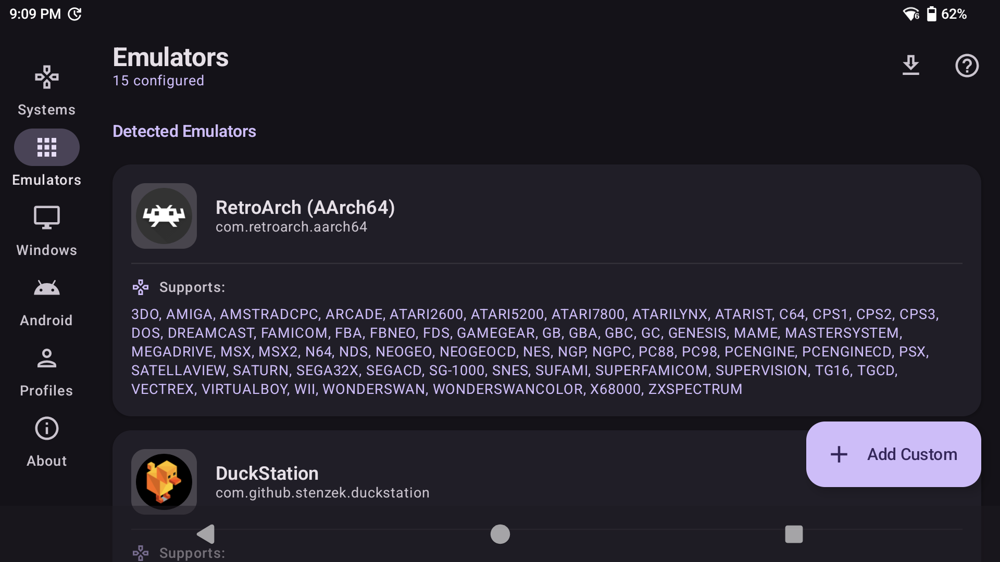
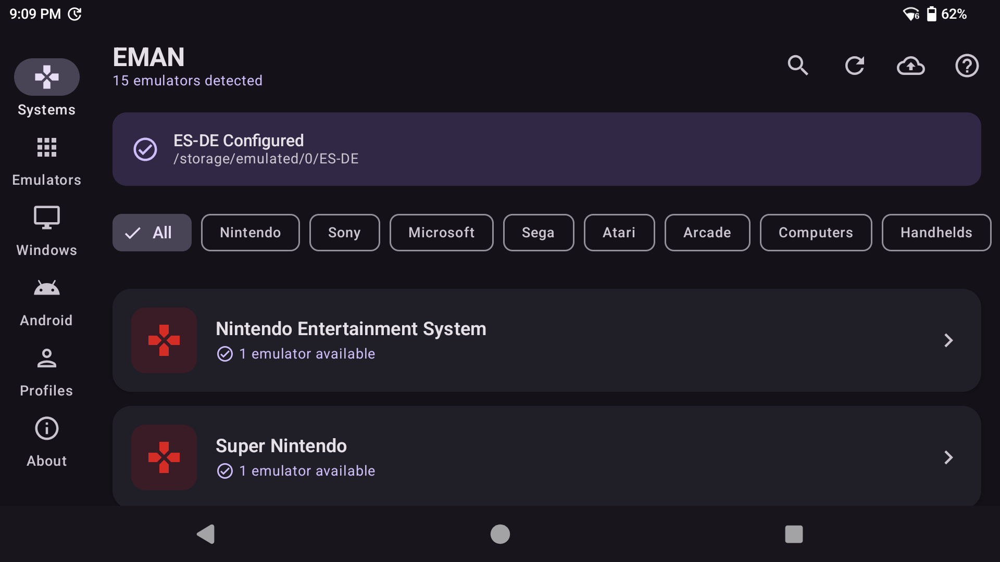
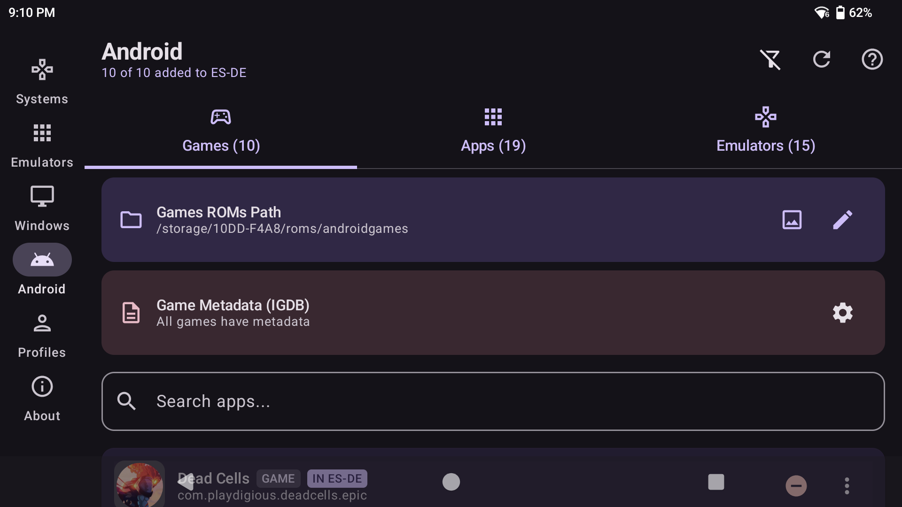
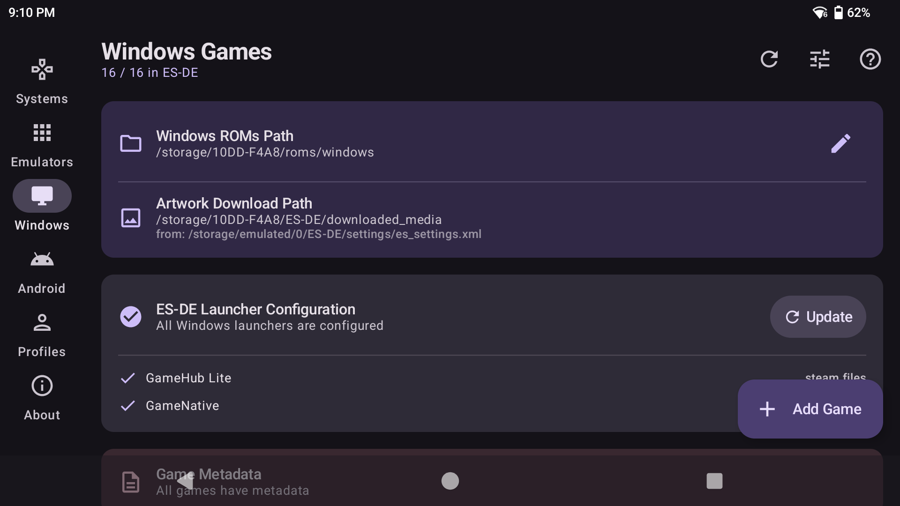
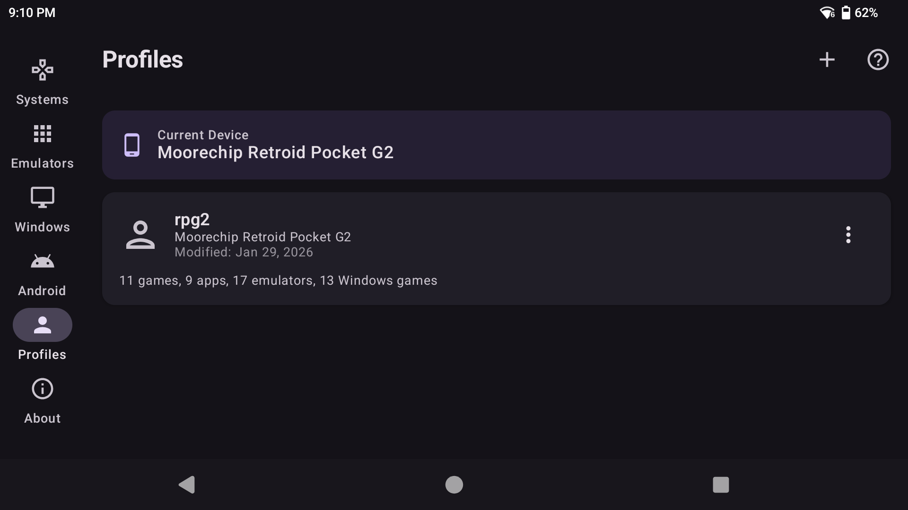
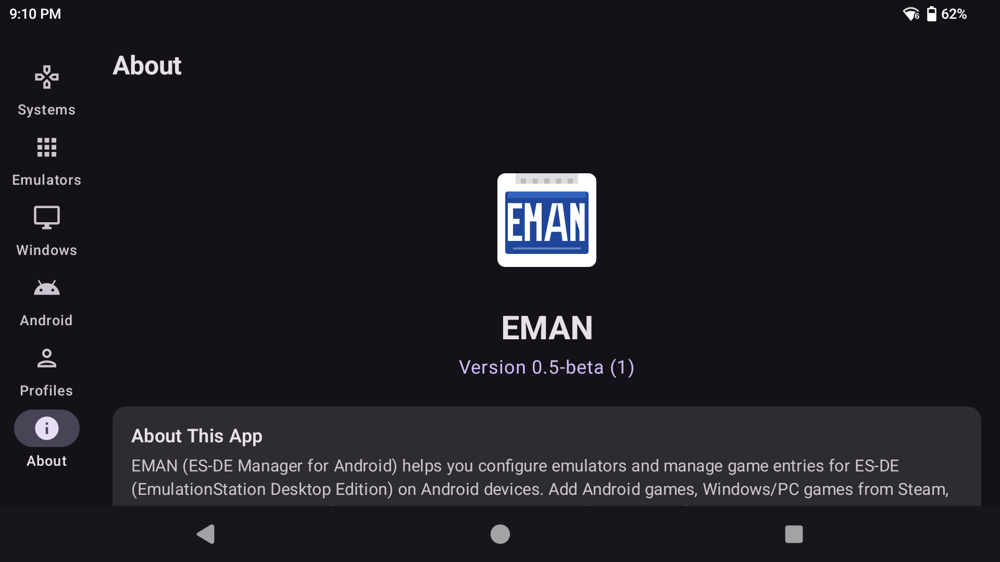

# EMAN — ES-DE Manager for Android

[](LICENSE)
[](https://android.com)
[-orange.svg)](https://developer.android.com)
[](https://github.com/strikelight/EMAN/releases)

**EMAN** is an Android companion app for [ES-DE (EmulationStation Desktop Edition)](https://es-de.org). It lets you configure emulators, manage game library shortcuts, and control your ES-DE setup — all without editing XML files by hand.

---

## Features

- 🎮 **Configure ES-DE system emulators** — set primary and alternative emulators for every gaming system
- 📱 **Add Android games, apps, and emulators** to your ES-DE library
- 🖥️ **Add Steam, GOG, and Epic Games titles** to ES-DE as Windows/PC entries
- 🕹️ **GameHub Lite & GameNative launcher** configuration support
- 📥 **Scrape metadata, artwork, and video previews** automatically from online databases
- 🖼️ **Auto-generate cover artwork** from installed Android app icons
- ⚙️ **Add and configure custom emulators** for any system
- 💾 **Save and restore configurations** with the Profiles system
- 🔄 **Backup your ES-DE emulator configuration** at any time

---

## Requirements

- **ES-DE** installed on your Android device and launched at least once (to create its folder structure)
- **Android 8.0 (API 26)** or higher
- **All Files Access** storage permission (required to read/write ES-DE configuration files)

---

## Installation

### Option A: Download APK (Recommended)

Download the latest APK from the [Releases page](https://github.com/strikelight/EMAN/releases) and install it on your device.

> You may need to enable "Install from unknown sources" in your Android settings.

### Option B: Build from Source

See [Build Instructions](#build-instructions) below.

---

## Build Instructions

### Prerequisites

- [Android Studio](https://developer.android.com/studio) (Hedgehog or newer)
- JDK 17
- Android SDK with API 34

### Steps

```bash
# Clone the repository
git clone https://github.com/strikelight/EMAN.git
cd EMAN

# Build debug APK
./gradlew assembleDebug

# The APK will be at:
# app/build/outputs/apk/debug/app-debug.apk
```

Or simply open the project in Android Studio and click **Run**.

---

## Screenshots

| Home Screen | System Configuration | Android Games |
|:-----------:|:-------------------:|:-------------:|
|  |  |  |

| Windows / Steam / GOG | Profiles | About |
|:---------------------:|:--------:|:-----:|
|  |  |  |

---

## How It Works

EMAN reads and writes ES-DE's configuration files directly on your device's storage:

- **Emulator config** — reads `es_systems.xml` and `es_find_rules.xml` to detect installed emulators and let you configure which one ES-DE uses per system
- **Game shortcuts** — creates `.app`, `.steam`, `.gog`, `.epic`, `.desktop`, and `.gamehub` shortcut files in ES-DE's ROM folders so those games appear in your ES-DE library
- **Profiles** — serializes your entire ES-DE setup (emulator mappings + all shortcuts) to a JSON file stored in your ES-DE folder, enabling easy backup and restore across devices

---

## Project Structure

```
app/src/main/java/com/esde/emulatormanager/
├── data/
│   ├── model/          # Data classes (GameSystem, Profile, etc.)
│   ├── parser/         # ES-DE XML config reader/writer
│   └── service/        # Business logic (Steam/GOG/Epic APIs, ProfileService, etc.)
├── di/                 # Hilt dependency injection
├── ui/
│   ├── components/     # Reusable Compose components
│   ├── navigation/     # App navigation
│   ├── screens/        # All screen composables
│   └── viewmodel/      # ViewModels
└── MainActivity.kt
```

---

## Contributing

Contributions, bug reports, and feature requests are welcome! Please open an [issue](https://github.com/strikelight/EMAN/issues) or submit a pull request.

---

## License

Copyright 2026 strikelight

Licensed under the [Apache License, Version 2.0](LICENSE).

---

## Credits

- [ES-DE (EmulationStation Desktop Edition)](https://es-de.org) — the frontend this app is designed to work with
- [Buy me a coffee ☕](https://buymeacoffee.com/strikelight) — if you find EMAN useful!
